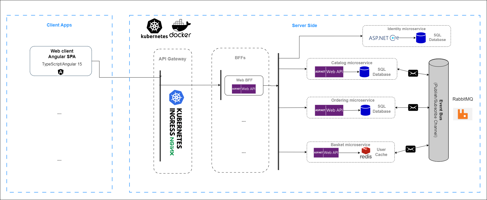

# Heracles Store
Cross-platform .NET microservices and container based web application that runs on Linux, Windows and macOS. This application is based on microservice architecture.

### Architecture overview
The Heracles Store application is cross-platform at the server and client side.
The architecture proposes a microservice oriented architecture implementation with multiple autonomous microservices 
(each one owning its own data/database) and implementing different approaches (simple CRUD vs DDD/CQRS) within each microservice using HTTP 
as the communication protocol between the client apps and the microservices and supports asynchronous communication for data 
updates propagation across multiple services based on Integration Events and an Event Bus (RabbitMQ).



### Application is still in development

### Getting Started

Make sure you have installed and configured [docker](https://docs.docker.com/docker-for-windows/install/) in your environment. After that, you can run 
the below commands from the **/src/** directory and get started with the Heracles Store immediately.

```powershell
docker-compose build
docker-compose up
```

You should be able to browse different components of the application by using the below URLs :

```
Web SPA :  http://host.docker.internal:5104/
```

>Note: If you are running this application in macOS then use `docker.for.mac.localhost` as DNS name in `.env` file and the above URLs instead of `host.docker.internal`.
